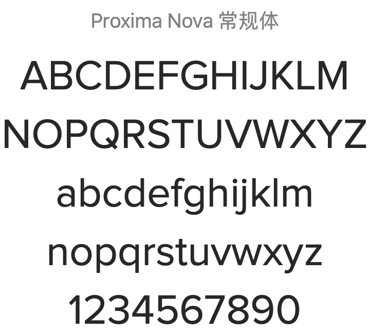
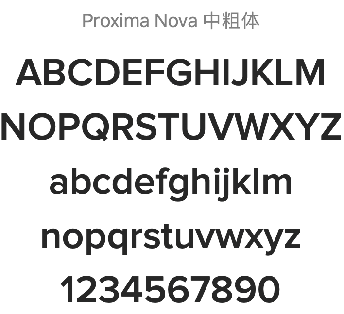
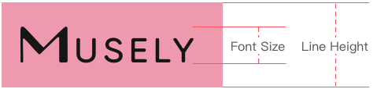

<!--
 * @Author: Victor wang
 * @Date: 2020-04-20 01:33:16
 * @LastEditors: Victor.wang
 * @LastEditTime: 2020-04-27 18:58:41
 * @Description:
 -->
<script>
  export default {
    data() {
      return {
        global: {},
        'font_size_extra_large': '20px',
        'font_size_large': '18px',
        'font_size_medium': '16px',
        'font_size_base': '14px',
        'font_size_small': '13px',
        'font_size_extra_small': '12px'
      }
    }
  }
</script>

# Font 字体

对字体进行统一规范，力求在各个操作系统下都有最佳展示效果,默认为 ProximaNovaRegular .

### 字体

<div class="demo-font">


</div>
<div class="demo-font">


</div>

### 字号

<div class='demo-block demo-font'>
  <table class="table font-size">
    <tbody>
      <tr>
        <td>层级</td>
        <td>字体大小</td>
        <td class="color-dark-light">举例</td>
      </tr>
      <tr
      :style="{ fontSize: font_size_extra_small }"
      >
        <td>辅助文字</td>
        <td class="color-dark-light">{{font_size_extra_small}} Extra Small</td>
        <td>Let’s Find Out What Product is Best For You </td>
      </tr>
      <tr
      :style="{ fontSize: font_size_small }"
      >
        <td>正文（小）</td>
        <td class="color-dark-light">{{font_size_small}} Small</td>
        <td>Let’s Find Out What Product is Best For You </td>
      </tr>
      <tr
      :style="{ fontSize: font_size_base }"
      >
        <td>正文</td>
        <td class="color-dark-light">{{font_size_base}} Base</td>
        <td>Let’s Find Out What Product is Best For You </td>
      </tr>
      <tr
      :style="{ fontSize: font_size_medium }"
      >
        <td>小标题</td>
        <td class="color-dark-light">{{font_size_medium}} Medium</td>
        <td>Let’s Find Out What Product is Best For You </td>
      </tr>
      <tr
      :style="{ fontSize: font_size_large }"
      >
        <td>标题</td>
        <td class="color-dark-light">{{font_size_large}} large</td>
        <td>Let’s Find Out What Product is Best For You </td>
      </tr>
      <tr
      :style="{ fontSize: font_size_extra_large }"
      >
        <td>主标题</td>
        <td class="color-dark-light">{{font_size_extra_large}} Extra large</td>
        <td>Let’s Find Out What Product is Best For You </td>
      </tr>
    </tbody>
  </table>
</div>

### 行高

<div class="demo-block demo-font">

  <ul class="lineH-right">
    <li>line-height:1 <span>无行高</span></li>
    <li>line-height:1.3 <span>紧凑</span></li>
    <li>line-height:1.5 <span>常规</span></li>
    <li>line-height:1.7 <span>宽松</span></li>
  </ul>
</div>

### Font-family 代码

```css
font-family: 'ProximaNovaRegular,ProximaNovaSemibold,,ProximaNovaBold,GilroyRegular,GilroySemiBold,GilroyBold';
```
